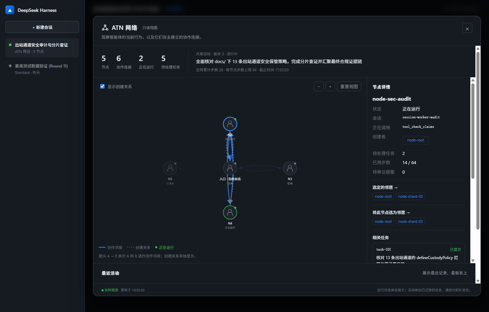

# dsh-ATN：DeepSeek Harness 自适应拓扑网络

<div align="center">

### **布线会变，边界不变。**
#### *Topology adapts, boundaries hold.*

面向高安全、多租户与严格合规场景打造的智能体间拓扑隔离与可控协作基础设施。

[](package.json)
[](LICENSE)
[](tests/)
[](tests/)
[](docs/)

</div>

---

## 💡 为什么选择 dsh-ATN？

在多智能体系统（Multi-Agent Systems）落地生产环境的过程中，企业面临着两难困境：
- **静态工作流或原生 Team**：拓扑结构死板，节点间缺乏动态寻路能力；更致命的是**完全缺乏宿主级的数据隔离机制**，任一节点的上下文扩散都可能导致数据越权或信息污染。
- **自由交互群聊**：缺乏出度与拓扑管控，极易引发广播风暴、上下文爆炸与不可控的虚假事实传播。

**dsh-ATN 带来了一个前所未有的、经过双向严密实证的坚实解法：**

> **节点可以自由重连，但永远说不出自己未曾持有的数据。**

| 架构层级 | 负责维度 | 运行性质 | 严密实证支撑 |
|---|---|---|---|
| 🕸️ **拓扑层 (Topology)** | **能和谁说话**（物理可达性） | **动态自适应**：节点可按需自主换边，支持局部探索，出度严格受限（≤ 4） | **第 5 轮严格结构证明**：证明自适应换边能够到达静态拓扑在物理约束下不可达的协作节点（零模型调用的确定性证明）。 |
| 🛡️ **保管层 (Custody)** | **能说什么**（数据合法声称） | **宿主强约束**：不变的边界底线，出站通道逐一审查，无权声明即刻熔断 | **0.5.0 全量安全审计**：完整锁定全部 13 条出站通道，修复前拦截留档，彻底杜绝数据洗白。 |

这是 DeepSeek Harness 原生 Team 所完全不具备的能力——**原生 Team 既无法动态自适应拓扑，也无法提供宿主级强制的数据保管边界**。

---

## 🎯 专为严苛场景而生

dsh-ATN 不迎合虚浮的“通用协同”幻想，而是精准解决对**可证明隔离性**有强诉求的专业场景：

- 🏢 **多租户 Agent 基础设施**：多租户共享底座模型与 Agent 服务时，杜绝租户私有上下文与数据资产跨节点横向穿透。
- 🔍 **安全审查与合规审计**：对智能体协作链路有严格可追溯性要求，需要形式化证明“没有任何智能体在生命周期中传输或声称过未授权数据”。
- 🔒 **严格知悉范围（Need-to-Know）协同**：研发链路中模块 A 的智能体需要与模块 B 智能体对齐接口，但绝对禁止接触模块 B 的内部实现上下文。
- 🏛️ **金融 / 医疗 / 司法高合规流水线**：将数据主权与实体权限（Artifact ID）严格映射至智能体节点，提供零旁路的数据流动保障。

---

## 🌟 核心能力优势

### 1. 🛡️ 宿主强制的信息边界（Host-Enforced Boundary）
- **全通道审查**：覆盖 `start`、`spawn`、`send`（task/note/result）、`status`（review/claim/rewire）、`finish` 及保留治理 API 共 **13 条出站通道**。
- **原子拦截无副作用**：未持有 artifact 的虚假声称（`evidence-not-owned`）会在持久化或派发前被绝对拦截，不修改网络状态、不扣减步数配额、不留下脏数据。
- **杜绝数据洗白**：结果回执、评价反馈、可选传输字段（`messageId`、`dependsOn`、`retryOf`）全方位审计，彻底封堵隐式隧道。

### 2. 🔍 宿主派生的安全知识发现（Derived Discovery）
- **告别不可控白板**：0.5.0 彻底废除了易被夹带任意事实的自由文本白板，将工具面收敛至纯粹的 5 个核心工具。
- **防虚报元数据**：`atn_status(query=...)` 检索候选节点时，其文档与标签（topics）完全由**宿主从真实 Custody 注册表反向派生**。智能体无法自报虚假专长，发现即代表真实持有。

### 3. 🕸️ 高效局部自适应拓扑（Adaptive Topology）
- **出度硬顶控制**：单节点最大活跃出边为 4，从物理机制上切断广播泛滥，维持拓扑稀疏度。
- **零开销遥测捎带**：本地静默统计任务延迟、步数消耗与终态；在节点正常接收输入时捎带拓扑健康摘要，**零额外模型唤醒，零额外 Token 费用**。
- **自主换边寻路**：节点基于真实评价与任务历史，通过 `atn_status(rewire=...)` 自主重连协作伙伴，快速适应多阶段任务变迁。

### 4. ⚙️ 企业级事务性架构与自愈保障
- **串行原子 Mutation 队列**：按 `networkId` 严格隔离的串行写事务，读、配额校验、ID 分配与持久化在同一临界区原子执行，彻底杜绝并发死锁与状态竞争。
- **孤儿任务原子认领**：节点异常离线或耗尽预算时，未完成任务自动转为孤儿状态；空闲节点通过 `atn_status(claimTaskId=...)` 抢占接管，流程永不悬空。
- **两阶段平滑退休**：节点按 `Draining`（处理在途义务、停止接新单）→ `Retired`（注销资源句柄）两阶段优雅离线，保障系统平稳收拢。

---

## 📊 原生 Web GUI 实时拓扑看板

在 DeepSeek Harness Web GUI 中运行 ATN 预设任务，点击顶栏 **「可视化ATN网络」** 即可一键展开实时拓扑监控看板：

<div align="center">



</div>

- **动态有向连通图**：直观展示节点间的协作出边、单向/双向调用通道与亲缘谱系。
- **全景健康状态**：实时监控各节点当前负载、正在执行的动作、步数配额余量及历史履约率。
- **零侵入观察通道**：复用 Harness 认证观察流，纯只读拉取，绝不主动唤醒模型或增加系统负载。

---

## 🛠️ 精简模型交互面：五大核心工具

0.5.0 去粗取精，彻底剔除不可控的自由文本白板，将模型操作面收敛为 5 个高内聚工具：

| 工具名称 | 核心输入参数 | 核心职责与业务价值 |
|---|---|---|
| `atn_start` | `objective`, `successCriteria`, `constraints` | 初始化协作网络并确立初始目标，分配入口根节点。 |
| `atn_spawn` | `task`, `context`, `leaseMs` | 在拓扑中创建同能力工作节点，继承安全预设并建立初始边。 |
| `atn_send` | `to`, `kind` (`task`\|`note`\|`result`), `body`（`result` 需携带 `taskId`, `summary`, `evidence`） | 点对点加密级安全通信；支持下发子任务、同步进展及带权属证据的交付结算。 |
| `atn_status` | 可选读：`query`, `taskIds`<br>可选写：`claimTaskId`, `review`, `rewire` | **一体化状态中枢**：查询拓扑邻居、原子认领孤儿任务、提交履约评价及自主换边重连。 |
| `atn_finish` | 可选 `scope="node"\|"network"`（网络级需 `summary`, `goalVersion`） | 优雅履行责任退出：单个节点退休（node）或全网汇聚交付最终结论（network）。 |

---

## 🚀 快速上手

### 环境要求
- Node.js >= 24
- DeepSeek Harness >= 0.2.0-rc.2
- Cordis 4.0.4

### 1. 从 npm 安装已发布版本
```bash
# 安装已发布版本至 web profile
dsh plugin --profile web add dsh-atn@0.5.0

# 检查配置中是否包含 atn 扩展
dsh --profile web --dump-config
```

### 2. 从源码构建安装最新版本 (0.5.0 信息边界)
```bash
git clone https://github.com/ff66ccff/dsh-ATN.git
cd dsh-ATN
npm ci
npm run build
npm run pack:tarball
dsh plugin --profile web add ./.artifacts/dsh-atn-0.5.0.tgz
```

### 3. 配置宿主保管策略（最小接入示例）
在宿主启动网络前，通过 `defineCustodyPolicy` 声明数据保管权限与提取规则。以下代码展示如何安装策略并原子拦截无权声称：

```typescript
import { defineCustodyPolicy } from 'dsh-atn'

// 1. 宿主真实授权映射（由宿主业务系统授予/撤销，不可由模型声明）
const custodyTable = new Map<string, Set<string>>([
  ['node-1', new Set(['finance-report-2026', 'shared-guidelines'])],
  ['node-2', new Set(['engineering-spec'])],
])

// 2. 声明策略规则
const policy = defineCustodyPolicy({
  // 返回该节点真实持有的合法 artifact 列表
  custody: (nodeId) => custodyTable.get(nodeId) ?? [],

  // 从出站消息的任意字段中解析声称持有的 artifact ID
  extractClaims: (input) => [
    ...JSON.stringify(input).matchAll(/claim:([a-z0-9-]+)/g)
  ].map(m => m[1]),

  // 由宿主提供合规的结构化元数据，驱动 atn_status 安全发现
  describeArtifact: (id) => ({ topics: [id] }),
})

// 3. 安装到全局网络，返回释放句柄
const disposePolicy = ctx.atn.installOutboundPolicy('*', policy)
```

验证内置端到端安全用例（**零付费 API 消耗**）：
```bash
node --import tsx/esm examples/information-boundary.ts
# 输出: Owned note/result accepted; unowned review refused atomically; custody discovery works without a board.
```

---

## 🏆 极致诚实：说的每一句话都有测试背书

在行业普遍充斥着过度宣传（Overclaim）与个例跑分的背景下，**dsh-ATN 坚信：科学的真实性才是最不可替代的技术壁垒。**

我们量了十一轮，公开透明地记录了所有对照数据。**负面结果不是尴尬，而是最具公信力的工程徽章。**

### 1. 十一轮等预算实测终轮收束结论 (Round 11)
我们在严格对齐的等预算约束下，使用 `deepseek-v4.1-flash` 完成了五臂各 14 个配对 seed、共 **70 次真实模型调用**的终轮基准评测：

| 评估臂 (Arm) | 精确通过率 | Wilson 95% 置信区间 | 任务墙钟中位数及 95% 区间（秒） | 配对模型调用数相对差 |
|---|:---:|:---:|:---:|:---:|
| `single` (普通单智能体) | 9/14 | 38.76% – 83.66% | 106.08 [96.92, 115.78] | 基准 |
| `single-scaffolded` (逐分片单智能体) | 13/14 | 68.53% – 98.73% | 119.83 [101.26, 143.35] | +13 次 |
| `independent-pool` (独立无通信池) | 12/14 | 60.06% – 95.99% | 107.95 [98.09, 125.40] | +1 次 |
| `native-team` (Harness 原生 Team) | 14/14 | 78.47% – 100.00% | 204.37 [151.81, 334.78] | +21 次 |
| **`atn-adaptive` (自适应拓扑)** | 10/14 | 45.35% – 88.28% | 156.96 [131.18, 199.19] | **较原生 Team 少 21 次** (p=0.00366) |

**客观科学的判读结论**：
- 经精确 McNemar 检验与严格的 Holm 多重比较校正，**未建立 ATN 相对其他臂在最终任务正确率上的统计学优势**。
- ATN 在复杂任务通信中较原生 Team 显著节省了模型调用次数（配对中位数减少 21 次），但分布式通信客观上增加了调度墙钟耗时。
- **我们明确宣布等预算研究线在本轮正式收束，全部结论锁定为 `causalClaim=false`**。详细审计见 [第 11 轮五臂报告](docs/EQUAL_BUDGET_BENCHMARK_IMPLEMENTATION_REPORT_V3.md)。

### 2. 严守客观的宣传红线
在 dsh-ATN 的产品与宣传词典中，**明确禁止使用以下过度宣传词汇**：
- ❌ **更快**（分布式协作存在固有的信令开销，无隔离需求时单智能体更直接）
- ❌ **涌现**（不依赖神秘玄学，只相信可复现的代码与宿主规则）

### 3. 严肃而并列的安全边界限制（非脚注）
宿主策略提供的是“**禁止节点声称持有未被授予的数据**”。遵循负责任的安全披露准则，它明确**不包含**以下防护：
1. **不防推理衍生**：智能体可从合法数据中提炼推论并传递；策略约束 Artifact 身份标识，不度量语义信息熵。
2. **不防物理侧信道**：交互延迟、正文字节数、调用频次及错误码反馈等侧信道可能残留信号。
3. **不防合谋互通**：两个合法持有不同数据的节点可在策略许可范围内主动互换数据。
4. **网络内部生效**：仅约束 ATN 框架内的 13 条出站通道，不拦截智能体在 ATN 外直接调用宿主未纳管能力的动作。

---

## 🗺️ 未来演进路线：沿“信任轴”持续深耕

我们不再堆砌复杂的协作玩法去赌虚无缥缈的“群体智能”，而是**全面沿着确定性的信任与安全轴稳步演进**：

- 🔑 **丰富数据保管模型**：引入只读（Read-Only）、有期租约（TTL-based）、跨节点委托（Delegation）及动态撤销（Revocation）等企业级细粒度访问控制。
- 📜 **拦截日志转化为合规产品**：将原子拒绝事件格式化为合规审计报告，为企业提供“智能体间绝对无越权数据传输”的形式化证明工件。
- 🛡️ **拓扑换边纳入策略管辖（Topology-as-ACL）**：将 `rewire` 从单纯的出度配额控制升级为策略级微隔离机制，宿主可按节点安全密级决定“谁能连谁”。
- 💾 **对接真实数据权限底座**：将保管表与底层文件系统 ACL、数据库行级安全性（RLS）和企业 IAM 授权体系实时挂接。

---

## ⚙️ 灵活配置项 (Cordis Config)

可在 Profile 的 `cordis.patch.yml` 中自由微调网络参数：

| 配置参数 | 默认值 | 作用说明 |
|---|---|---|
| `maxCollaborationPeers` | `4` | 单节点最大出边协作邻居数（硬约束 1–4） |
| `maxResidentNodes` | `8` | 网络内最大并发驻留活跃工作节点数 |
| `maxTotalNodes` | `32` | 单网络生命周期内累计允许创建的最大节点数 |
| `stepBudget` | `64` | 单节点准入步数硬配额，耗尽后进入优雅退休 |
| `maxTasks` | `256` | 单网络最大支持的累计任务数 |
| `maxMessageBytes` | `8192` | 单条通信消息最大 UTF-8 字节数 |
| `defaultLeaseMs` | `300000` | 默认任务租约超时时长（5 分钟） |
| `networkDeadlineMs` | `3600000` | 网络硬性总生命周期上限（60 分钟） |
| `domainName` | `atn_networks` | 隔离存储域命名空间 |

---

## 🧪 工程质量与测试矩阵

项目坚持零技术债务，配备了极其严苛的工程测试与静态审计体系：

```bash
npm install              # 安装依赖
npm run typecheck        # 严格 TypeScript 类型检查
npm test                 # 执行全量 550+ 项测试（零真实 API 消耗，毫秒级自愈验证）
npm run build            # 构建生产分发产物
npm run pack:tarball     # 打包 tgz 安装包
npm run smoke:profile    # 运行真实 DSH Profile 完整集成烟测
```

- **550+ 项自动化测试**：全面覆盖拓扑演化、13 通道出站审查、并发竞争、状态回放、故障补偿及 Web UI。
- **红灯失败测试在先留档**：信息边界重构与漏洞修复严格遵守“先提交失败测试留档、再实施代码修复”原则，留档见 [`docs/information-boundary/`](docs/information-boundary/)。

---

## 📚 延伸阅读与文档索引

完整技术报告与历史档案请参阅 [**dsh-ATN 文档库索引指南**](docs/README.md)：
- 🧭 [**战略定位与演进白皮书**](docs/STRATEGY_AND_POSITIONING.md)：深度拆解设计哲学与信任轴演进逻辑。
- 🛡️ [**13 条出站通道审计契约**](docs/information-boundary/OUTBOUND_CHANNEL_AUDIT.md)：查看出站通道与拒绝码定义。
- 🧪 [**第 11 轮五臂等预算评测报告**](docs/EQUAL_BUDGET_BENCHMARK_IMPLEMENTATION_REPORT_V3.md)：查阅 70 次真实运行的原始统计数据。

---

## 📄 开源协议

本项目采用 [Apache-2.0](LICENSE) 许可证开源。遵循相关第三方开源声明与规范，详见 [NOTICE](NOTICE)。
